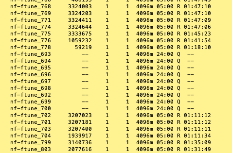

## A Note about resource requests on HPC systems

When working with High Performance Computing (HPC) systems, it's crucial to understand how to request resources effectively. HPC systems are designed to handle large-scale computations and multiple users, so resource management is key to ensuring fair usage and optimal performance.

When requesting resources (time, number of cpu, memory, etc.) for your jobs, remember the following:

**Be specific**: Always specify the exact resources your job needs. This includes the number of CPU cores, amount of memory, and time required for the job to run. Over-requesting resources can lead to longer wait times in the queue, while under-requesting can cause your job to fail if it runs out of resources.

**Use the right partition**: HPC systems often have different partitions for different types of jobs (e.g., CPU-intensive, GPU-intensive, etc.). Make sure to submit your job to the appropriate partition that matches your job's requirements.

**Don't over request**: While it might be tempting to request more resources than you think you'll need, this can lead to inefficiencies and longer wait times for your job. Try to estimate your resource needs as accurately as possible. The following image demonstrates the impact of over-requesting resources on job wait times in the queue.

Here, the jobs that requested 5 hours of time have been running for over 1 hour, while those that requested 1 day are still waiting, even the some of the 24 hr jobs were in the queue earlier. This is because the job scheduler prioritises jobs that request fewer resources, allowing them to run sooner.

The job scheduler also balances the request between users. Just because you submitted a job later than other users, doesn't mean your job will run later. If you request fewer resources than other users, your job may run sooner. Use the parallel computing resources efficiently to ensure that your job runs in a timely manner -- 100 jobs requesting 10 min each will run much faster and sooner than one job requesting 1000 min (17 hr).

